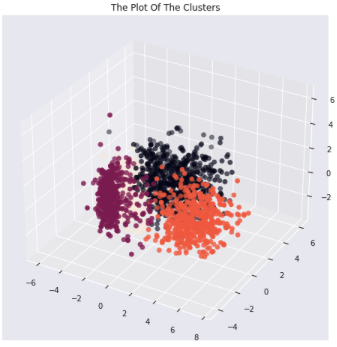
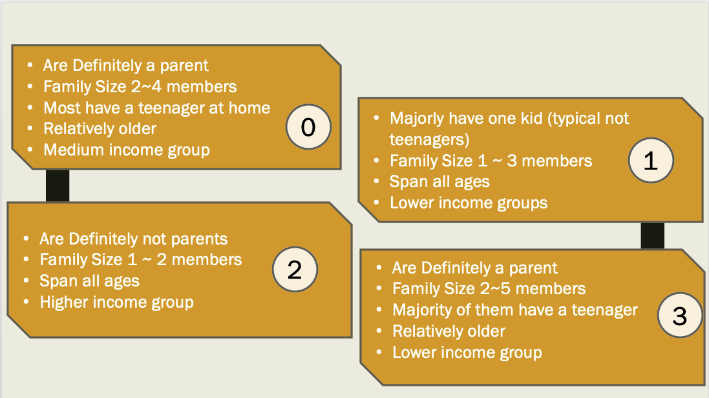
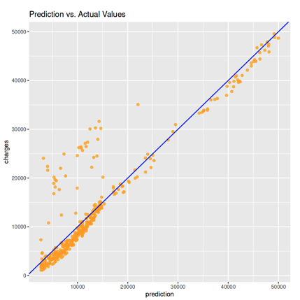
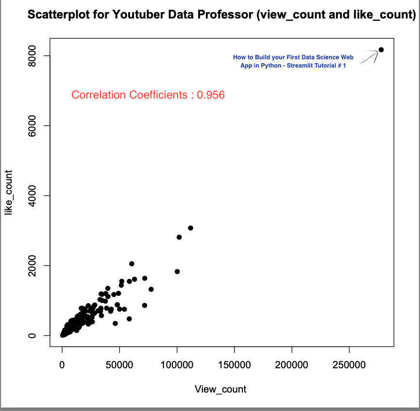
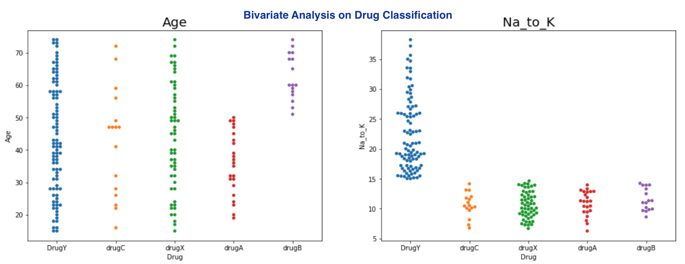
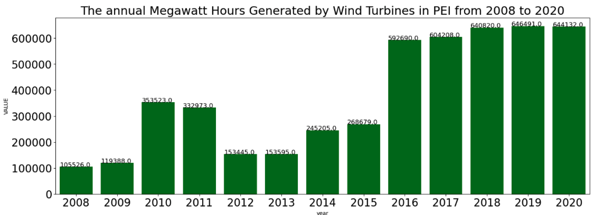
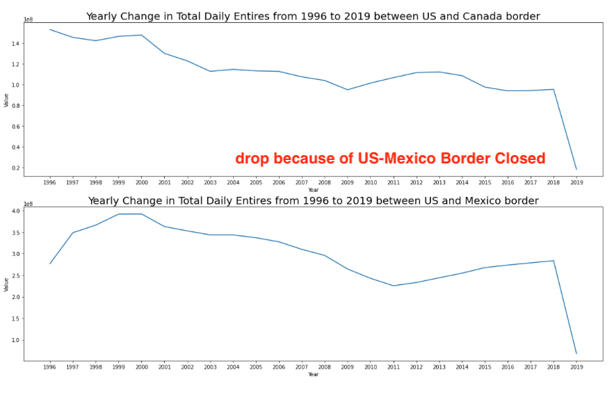

# About Me
I am Henry, a certificated data analyst who experiences in collecting, cleaning, analyzing, and visualizing data. With a background in biotechnology and sustainability, I possess the ability to derive valuable insights from complex datasets and present them in a clear and concise manner to stakeholders. My goal is to provide data-based solutions that enable organizations to enhance their performances and attain their objectives.  Driven by a passion for learning and a strong work ethic, I am enthusiastic about using my strong analytical, communication, and problem-solving skills, make me a valuable asset to any team looking to unlock the full potential of their data.

# My Data Analytic Project

## Tableau profile
[click](https://public.tableau.com/app/profile/hungen.liao) here

## Retail Customer Segmentation Analysis with Kmeans Clustering

To see more detail in the complete Project, please [click](https://www.kaggle.com/code/hungenliao/retails-customer-segmentation-clustering) here.

**Project Description** 

Smart Investment, less marketing resources waste. I utilized customer personality analysis allows businesses to adapt their products to suit the preferences of specific customer segments. Therefore, a company can analyze which customer segment is most inclined to purchase the product and focus their marketing efforts solely on that particular segment.

**Skills:** Data Cleaning, Python (Pandas, Seaborn, Matplotlib), Machine Learning (Clustering), PCA, Data Visualization, Statistics Modeling 

The following are the segementation result of this project

## Healthcare Insurance Regression Model Prediction in R

To see more detail in the complete Project, please [click](https://www.kaggle.com/code/hungenliao/medical-insurance-regression-r-2-0-87) here.

**Project Description** 

The expense of healthcare coverage in North America poses a financial hardship for the general population. I am interested in understanding the elements that can raise my premiums when considering purchasing medical insurance. To address this, I developed a regression machine learning model that predicts the insurance cost.

**Skills:** R (dplyr, tidyverse, ggplot2), Data Cleaning, Data Visualization, Hypothesis Testing, Feature engineering and Regression model 

The above picture is the prediction result, with adjusted R in 0.87

## Grabbing data from Youtube API and found Top 10 popular Video with MySQL (Python / SQL / R)

To see more detail in the complete Project, please [click](https://colab.research.google.com/drive/1LDEiJ6CFclnHoXzq6ZAfRWXEmyll_e-x?usp=sharing) here.

**Project Description** 

With a biotechnology background, I am curious how to become a data scientist from a biologist. Therefore, I found the Youtuber Data Professor and I am interested in the statistic information of Data Professor youtube channel. I grabbed data from Youtube API and inserted my data into relational database for further SQL analysis.

**Skills:** SQL, Database, Python (re, pandas, API Request), Regression Analysis, R 

The following notes are my interesting finding from SQL, and you can check my SQL code from [this link](https://hackmd.io/@WY7WYsMqTwyJzJLs_SoHcQ/HkDmsoLNh)

1. The most productive year for Data professor is 2021 and 2022

2. In the top 20 popular video (most view), all are published before 2021-04-13, except for the video "how to summerize text using ChatGPT", which is 11th on view_count leaderboard. However, the number of view doesn't reflect the number of likes. it only got 67th on like_count leaderboard.

From my explaination. CharGPT can increase people interest to watch the video, but it may not transfer to like if it is not innovative.

## Exploratory Data Analysis and Machine Learning on Drug Classification with Cross Validation

To see more detail in the complete Project, please [click](https://www.kaggle.com/code/hungenliao/drugs-classification-eda-ml-knn-rf) here.

 - Univarate Analysis and Bivariate analysis on different features, such as age, blood pressure with different drug types
 - Label Encoding : Na to Potassium Ration > 15  for specific drug Y
 - Build KNN classification model with crosss validation

## PEI Wind and Solar Energy Development to Replace Heating Oil

To see more detail in the complete Project, please [click](https://github.com/Liao993/PEI_RenewableEnergy.git) here.

**Project Description** 

PEI is developing wind energy and solar power to accelerate its renewable usage. From the project I did in Government of PEI, heating oil is the main contribution of carbon emissions from PEI. Therefore, I am curious what is current PEI wind  and solar power generation and how much electricity does it need for replacing heating oil

**Skills:** Python (Pandas, Seaborn, Matplotlib), Energy Analysis, Data Visualization 

**Key findings** 

* PEI wind energy generation has started to increase since 2016 
* The development of solar energy is still limited in PEI
* Based on the latest data i got, the electricity generated by wind power in PEI could only support 50% household to replace its heating system

## Exploratory Data Analysis on American busiest ports and Mexican labor migration

To see more detail in the complete Project, please [click](https://www.kaggle.com/code/hungenliao/american-busiest-ports-and-mexican-labor-migration) here.

**Project Description** 

As an immigrant in Canada. I want to know more about Canada and its neighbour, so I came out with this project. Canada and United States has the longest border in the world, so I am curious what is the border crossing situation between Canada and United States.I got the data from The Bureau of Transportation Statistics (BTS) Border Crossing Data, which provides summary statistics for inbound crossings at the U.S.-Canada and the U.S.-Mexico border at the port level. Because US-Mexico and US-Canada data are both included in this dataset. Therefore, I will make a comparsion of the inbound crossings situations between this two countries in  my project.

**Skills:** Python (Pandas, Seaborn, Matplotlib), Data Cleaning, Time Analysis 

**Key findings** 

The majority of entries between US-Canada and US-Mexico are due to Mexican seasonal workers, and this can infer why the **US-Mexico border closed by trump** also affected the number of entries between US and Canada

I have also did some web developemnt projects as well

# My Web Development Project
## [Project 1 : Blog Website for Global Island Traveling Experience](https://liao993.github.io/home.html)

the complete code can be seen from [here](https://github.com/Liao993/Liao993.github.io.git)

## [Project 2 : Restful API for traveling expenses notes (JavaScript/ Express / Node.js)](https://github.com/Liao993/travel-expense-restfulapi/tree/master)
1. Used a POST method in this RESTful API project to create a new resource or record by submitting data to the server.
2. Used Prisma as the ORM (Object-Relational Mapping) tool to define the database schema, generate the SQL queries, and provide a type-safe API for accessing the database.
3. Data Validation to make sure the correctness of data type between controller layer, service layer and database layer
