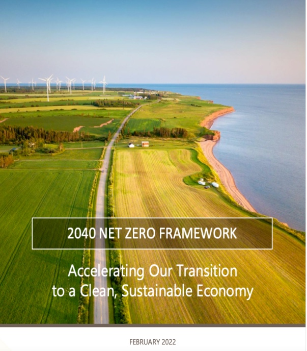

# HenryLiao_Portfolio

# My Data Analytic Project

## [Project 1 : Energy Consumption and Carbon Emission for Prince Edward Island (PEI) households](https://hackmd.io/@WY7WYsMqTwyJzJLs_SoHcQ/rkMAx2ME2)

This is the research project I worked with the Government of PEI. The Department of Environment, Energy and Climate Action in Government of PEI is working on building a net zero greenhouse gas emissions community. One of greenhouse emissions is from **household**. Therefore, my responsibility was to track the energy usage and carbon emission from PEI household in the past twenty years and analyze the amount of clean energy generated from wind or solor power.

The following are some key findings of this project, and the complete analysis process can be seen from the project 1 link.

* **Heating** (Space and Water heating) accounts for 90% of total energy usage in PEI household
* **All Greenhouse Emissions** in household are from **heating** becasue of heating oil usage in PEI
* the current electricity generated by wind turbines can support **50%** PEI households for heat usage.
* Mobile house is the house type consumed the most energy because of the poor insulation

## [Project 2 : Exploratory Data Analysis on American busiest ports and Mexican labor migration](https://www.kaggle.com/code/hungenliao/american-busiest-ports-and-mexican-labor-migration)

[dataset](https://www.kaggle.com/datasets/akhilv11/border-crossing-entry-data)

The Bureau of Transportation Statistics (BTS) Border Crossing Data provide summary statistics for inbound crossings at the U.S.-Canada and the U.S.-Mexico border at the port level. The data reflect the number of vehicles, containers, passengers or pedestrians entering the United States.

I used this dataset to discover the busiest ports in the United States as well as the border crossing situations.

there are some key obsevations I found from this dataset

* The top 3 measures are personal vehicles passengers, personal vehicles and trucks. This is similar in each state
* **The number of ports** between Canada and States are more than that between Mexico and States, and this is why the count of data for US-Canada border is significant higher. If we count **the number of entries**, Mexico was much higher than Canada.
* 75% of top 20 busiest border are between US and Mexico border.
* the number of entries between **US-Canada border decreased by 80%** in 2018 as well as US-Mexico border
* The majority of entries between US-Canada and US-Mexico are due to Mexican seasonal workers, and this can infer why the **US-Mexico border closed by trump** also affected the number of entries between US and Canada.

## [Project 3 : Top 10 popular videos from Youtube API (Python / SQL)](https://colab.research.google.com/drive/1LDEiJ6CFclnHoXzq6ZAfRWXEmyll_e-x?usp=sharing)

With a biotechnology background, I am curious how to become a data scientist from a biologist. Therefore, I found the Youtuber Data Professor and I am interested in the statistic information of Data Professor youtube channel. I grabbed data from Youtube API and found out top 10 popular videos with SQL.

The following notes are my interesting finding from SQL, and you can check my SQL code from [this link](https://hackmd.io/@WY7WYsMqTwyJzJLs_SoHcQ/HkDmsoLNh)

1. The most productive year for Data professor is 2021 and 2022
2. The top 3 popular videos are (both on the view_count and like_count leaderboard) 
      1. How to Build your First Data Science Web App in Python - Streamlit Tutorial # 1
      2. Web App in R : Building Your First Web Application in R - Shiny Tutorial Ep 1
      3. Bioinformatics Project from Scratch - Drug Discovery Part 1 
3. In the top 20 popular video (most view), all are published before 2021-04-13, except for the video "how to summerize text using ChatGPT", which is 11th on view_count leaderboard. However, the number of view doesn't reflect the number of likes. it only got 67th on like_count leaderboard.

From my explaination. CharGPT can increase people interest to watch the video, but it may not transfer to like if it is not innovative.

## [Project 4 : Exploratory Data Analysis and Machine Learning on Drug Classification with Cross Validation](https://www.kaggle.com/code/hungenliao/drugs-classification-eda-ml-knn-rf)

 - Univarate Analysis and Bivariate analysis on different features, such as age, blood pressure with different drug types
 - Label Encoding : Na to Potassium Ration > 15  for specific drug Y
 - Build KNN classification model with crosss validation

I have also did some web developemnt projects to gear up my coding skills
# My Web Development Project
## [Project 1 : Blog Website for Global Island Traveling Experience](https://liao993.github.io/home.html)

the complete code can be seen from [here](https://github.com/Liao993/Liao993.github.io.git)
